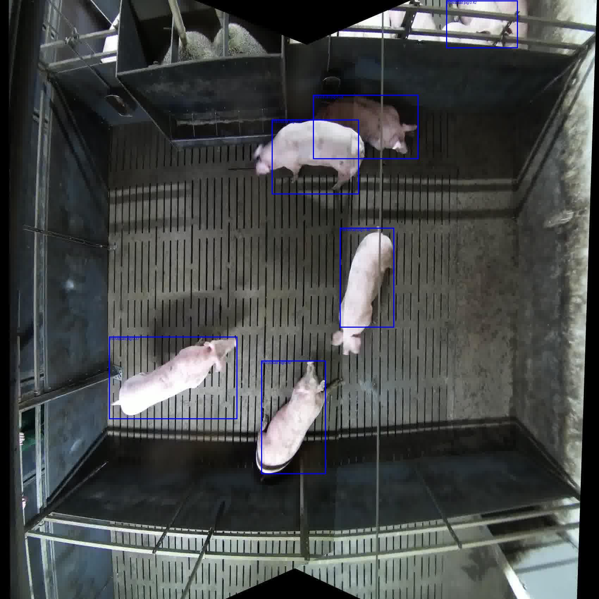

# itmo_cv_course

В этой ветке содержится решение 3-его ДЗ по курсу CV. Данное ДЗ состоит в реализации YOLOV1 с нуля для распознавания свиней и людей.
Задачи, которые необходимо решить:
- Подготовить датасет для обучения
- Реализовать архитектуру YOLO и методы для её обучения
- Реализовать NMS
- Реализовать метрику mAP
- Подобрать оптимальные гиперпараметры
- Залогировать результаты экспериментов (метрики, гиперпараметры, визуализации)

Все задачи успешно решены, исходный код решения предоставлен в скриптах и ipynb.

## Разметка данных

Первое, что необходимо сделать - подготовить и разметить данные для обучения модели. К ДЗ приланаются 10 видео в формате .mkv, содержащие записи помещения и свиней в нем, иногда на кадрах появляются люди. Необходимо разметить набор (получить ground truth bounding box'ы для свиней и людей) для обучения.
Для начала разметки, необходимо получить отдельные кадры из видео. Это можно сделать при помощи утилиты ffmpeg. Для удобства, в корне репозитория сохранен bash скрипт `extract_pigs.sh`, который принимает пути до папок с видео и выходными изображениями, и использует ffmpeg для извлечения 5 кадров из каждой секунды видео. После обработки, в выходной директории образуется 3010 изображений, готовых к разметке.

<em>Извлеченные изображения свиней</em>

Разметка изображений - сложная задача, которая занимает много человеко-часов разметки. Воспользуемся zero-shot моделями, специально обученными для этой задачи. Существует несколько современных вариантов, основными из которых являются [GroundingDINO](https://huggingface.co/IDEA-Research/grounding-dino-base) и [OwlV2](https://huggingface.co/google/owlv2-base-patch16). Они позволяют определять Bbox'ы большого количества объектов, в т.ч. людей и свиней.
После сравнения этих двух моделей оказалось, что OwlV2 значительно превосходит GroundingDINO в качетсве определения позиции и количества свиней:
| GroundingDINO | OwlV2 |
| --- | --- |
|  |  |

Исходя из тестов, модель OwlV2 была выбрана в качестве основной модели для разметки. Ноутбук `launch_grounding.ipynb` загружает изображения, запускает инференс, сохраняет разметку в формате YOLO ([class_id, x_center, y_center, width, height]) и делит все полученные изображения на обучающую и тестовую выборки.

<em>Пример размеченного изображения</em>

## Реализация

Следующий шаг - реализация YOLO. [Оригинальная статья](https://arxiv.org/pdf/1506.02640) дает полное описание архитектуры и подходов, использованных при разработке. Имплементация модели включает в себя следующие шаги по реализации:
| Скрипт       | Описание                                                                                                                                                                                                                                                                |
|--------------|-------------------------------------------------------------------------------------------------------------------------------------------------------------------------------------------------------------------------------------------------------------------------|
| `dataset.py` | Содержит класс torch dataloader'а, читающий разметку с диска и применяющим необходимые аугментации.                                                                                                                                                                         |
| `model.py`   | Содержит реализацию двух версий модели (обе с одинаковой головой): - Использующий стандартный бэкбон (`backbone_type="custom"`), отличающийся от оригинальной имплементации использованием LocallyConnected слоев вместо FullyConnected для большей эффективности. - Использующий предобученный resnet18 на ImageNet (`backbone_type="resnet18"`). Оригинальная версия модели также обучалась с предобученным бэкбоном. |
| `loss.py`    | Считает лосс согласно оригинальной статье, используя компоненты локализации, нахождения объектов и классификации.                                                                                                                                                          |
| `utils.py`   | Содержит основные методы для валидации модели, включая NMS и mAP.                                                                                                                                                                                                    |
| `train.py`   | Считывает конфиг обучения, устанавливает seed, готовит модели и данные, запускает обучение, сохраняет чекпоинты и графики метрик с лоссами.                                                                                                                                 |
| `inference.py`| Принимает на вход путь к чекпоинту обученной модели и изображение, прогоняет изображение через модель и сохраняет его версию с предсказанными bbox'ами по указанному пути.                                                                                                    |

## Эксперименты

Было проведено множество экспериментов с разными гиперпараметрами на двух версиях данных. В корне проекта находится папки `exps/` и `exps_pigsonly/`, обе содержащие два основных эксперимента, показавших наилучшие результаты: exp_default (стандартный бэкбон, обучение с нуля) и exp_resnet (предобученный resnet как бэкбон, замороженный первые 5 эпох).

Подобранные гиперпараметры:
| Секция       | Параметр                     | Описание                                                                                                |
| :----------- | :--------------------------- | :------------------------------------------------------------------------------------------------------ |
| **training** | `seed`                       | Значение для инициализации генераторов случайных чисел (для воспроизводимости).                           |
|              | `learning_rate`              | Начальная скорость обучения (learning rate) для оптимизатора (для "головы" модели и всего, если `freeze_backbone=False` или `backbone='custom'`). |
|              | `epochs`                     | Общее количество эпох обучения.                                                                         |
|              | `freeze_backbone`            | Флаг (`True`/`False`), замораживать ли веса backbone (например, ResNet) на начальных эпохах.             |
|              | `unfreeze_epoch`             | Номер эпохи, начиная с которой веса backbone (если были заморожены) размораживаются.                     |
|              | `lr_fine_tune`               | Скорость обучения (learning rate) для backbone после его разморозки (обычно меньше `learning_rate`).    |
| **model**    | `backbone`                   | Тип используемой базовой сети (feature extractor): `'custom'` (YOLOv1 из статьи) или `'resnet18'`.       |
|              | `S`                          | Размер сетки, на которую делится изображение (например, 7 для сетки 7x7).                                 |
|              | `B`                          | Количество предсказываемых bounding box'ов для каждой ячейки сетки.                                     |
|              | `C`                          | Количество классов объектов для детекции.                             |
| **dataset**  | `img_dir_train`              | Путь к директории с изображениями для обучающей выборки.                                                  |
|              | `label_dir_train`            | Путь к директории с файлами аннотаций (`.txt`) для обучающей выборки.                                    |
|              | `img_dir_test`               | Путь к директории с изображениями для тестовой/валидационной выборки.                                    |
|              | `label_dir_test`             | Путь к директории с файлами аннотаций (`.txt`) для тестовой/валидационной выборки.                       |
|              | `image_size`                 | Размер (высота и ширина), до которого изменяются изображения перед подачей в модель.                      |
|              | `normalize_mean`             | Средние значения для нормализации каналов изображений (список из 3 чисел).                              |
|              | `normalize_std`              | Стандартные отклонения для нормализации каналов изображений (список из 3 чисел).                         |
| **evaluation**| `map_iou_thresh`            | Порог IoU (Intersection over Union) для определения True Positive при расчете метрики mAP.               |
|              | `nms_iou_thresh`            | Порог IoU для алгоритма Non-Maximum Suppression (подавление избыточных боксов).                         |
|              | `conf_threshold`             | Минимальный порог уверенности (confidence score) для предсказанного bounding box'а при оценке/инференсе. |

Эксперименты в папке `exps/` проводились на данных, для которых была получена разметка по классам "individual pig" (свиньи) и "man view from above" (люди). Модели имеют схожие метрики:
| exp_default | exp_resnet |
| --- | --- |
|  |  |

Примеры инференса:
| exp_default | exp_resnet |
| --- | --- |
|  |  |

Эксперименты в папке `exps_pigsonly/` проводились на данных, для которых была получена разметка только по классу "individual pig" (свиньи). Модели имеют схожие метрики, значительно превосходящие версию с разметкой людей:
| exp_default | exp_resnet |
| --- | --- |
|  |  |

Примеры инференса:
| exp_default | exp_resnet |
| --- | --- |
|  |  |

Подобные результаты говорят о низком качестве разметки людей при помощи OwlV2.

## Выводы

В данной работе были собраны обучающие данные с разметкой свиней и людей, реализована архитектура YOLOv1 со вспомогательными функциями, проведены эксперименты по обучению с разными гиперпараметрами, получены результаты. Лучшим решением стала модель с предобученным resnet энкодером с результатом `mAP@0.5 ~ 0.3` при обучении на двух классах и `mAP@0.5 ~ 0.7` при обучении на одном классе (свиньи).